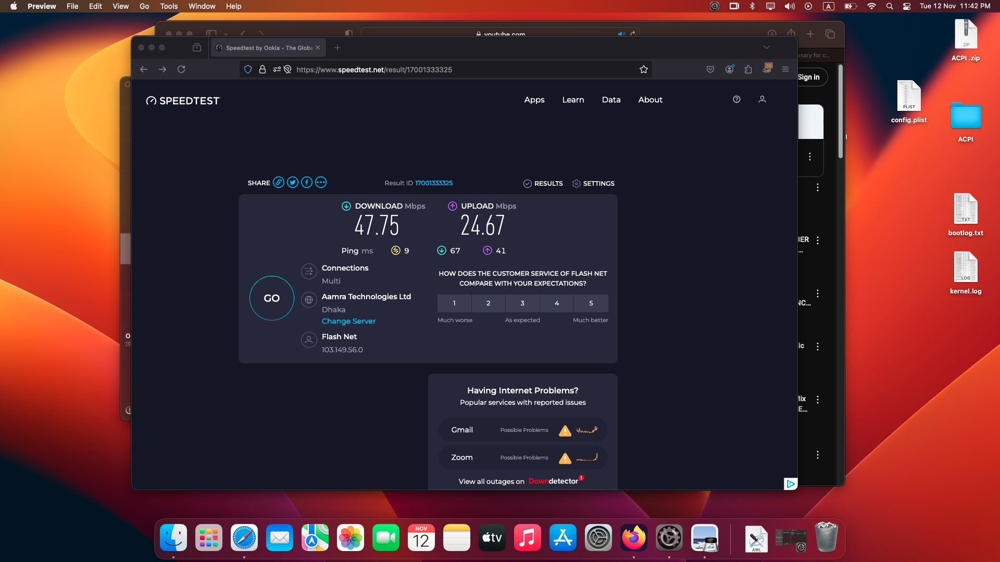
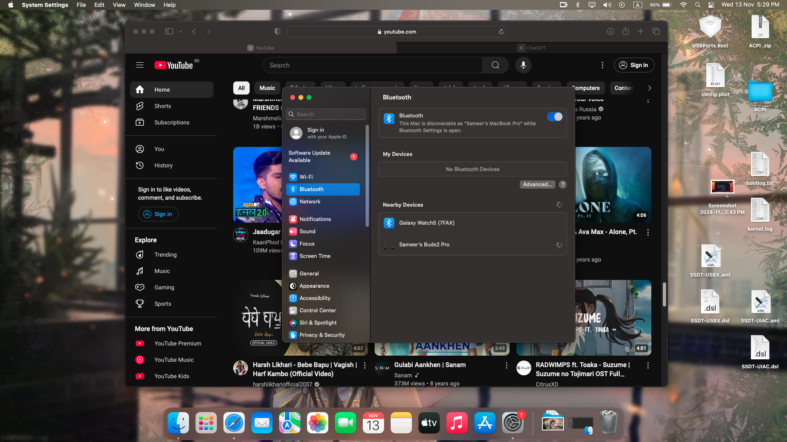

# HP-Elitebook-X360-1030-G2-Hackingtosh-EFI
Hackingtosh Ventura , Sonama for HP ELITEBOOK 1030 G2 X360 [SUCCESS]

# Laptop Specs
- <b>CPU</b>: [Intel Core i5-7200U/i3/i7-7600U Dual Core]
- <b>GPU</b>: [Intel HD 620 Graphics]
- <b>Storage</b>: 256GB-1TB SSD 
- <b>RAM</b>: 8 GB LPDDR4 2133MHz
- <b>Screen</b>: 13-inch FHD (1920x1080)  
- <b>Touchscreen</b>: Wacom Touch Display with 10 points touch and pen
- <b>Trackpad</b>: ALPS V8 [I2C]
- <b>Wi-Fi</b>: Intel Wireless 8265
- <b>Ports</b>: 1x USB Thunderbolt , 2x USB 3 , 1x HDMI 1.4 , 1x SD Card
- <b>Speakers</b>: Bang & Olufsen 4 way Speakers [ALC Layout-21]
- <b>Cameras</b>: HP HD Camera 720p and IR Camera 

# Whats Working
- Screen Brightness with Smooth backlight Animations 
- Sound with keys 
- Intel Bluetooth
- USB C Thunderbolt 
- SD Card Reader
- HP HD Camera and IR Camera 
- Microphone
- Touchscreen
- Trackpad upto 2 finger gestures only
- Intel WIFI Adapter [Fully Working and Stable]
- HDMI with External Display upto 144hz Refresh Rate
- Battery [ Upto 5 hours SOT] & Correct Percentage
- Smooth Performance [Can be compared with Macbook 2016]
- GPU with proper Accleration ~ 1536MB to 4096MB 
- Keyboard with all keys working
- Every External USB functions work fine
- USB WIFI tathering
- Shutdown
- Reboot
- Sleep
- iMessage, App Store , FaceTime , iCloud and also AppleTV [All Apple Services] 

# Whats not working
- Fingerprint Scanner [Dont ask as its unfixable]
- AirDrop [Need a Broadcom WIFI Card Replacement]

# Not Tested
- SIM Card and other Unknown Useless Ports 

  
# How to Install
Use Gen SMBIOS to generate UUID , SMBIOS , ROM [MacBookPro14,1] on EFI config.plist 
Use 16gb or up USB Drive to boot and install MacOS Normally [Make sure to format disk with APFS GUID Partition]

# BIOS Settings
- TPM Disable
- Secure Boot & Legacy Boot Disable
- Intel SGX - Software Control
- Integrated GPU Memory -- 64 MB
- Fast Charge off
- Fast Boot off
- HP Smart Card Power Savings off
- Make sure WLAN, Bluetooth & Touchscreen is on
  
# MacOS Versions Tested
  BigSur , Catalina , Mojave , Ventura and Sonoma [VENTURA Recommended]

# Screenshots

